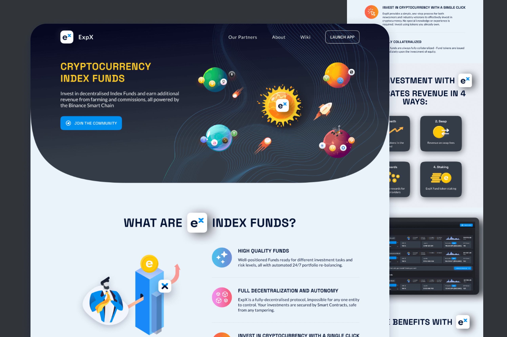
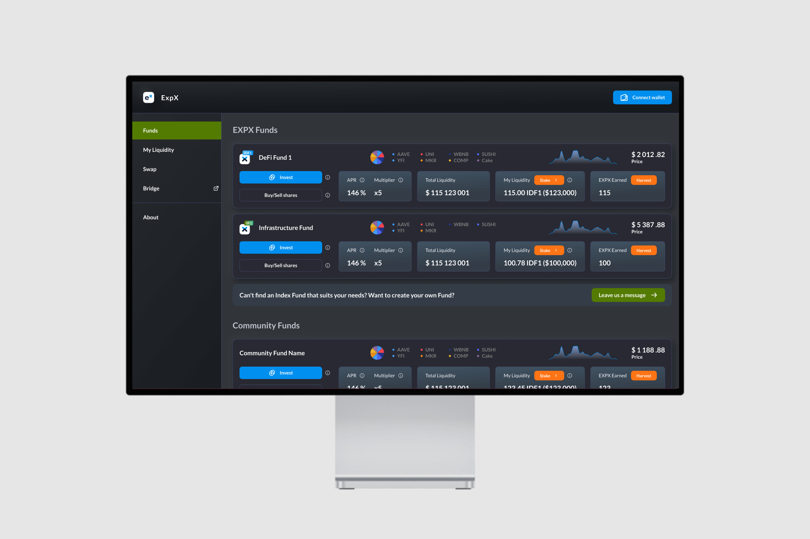
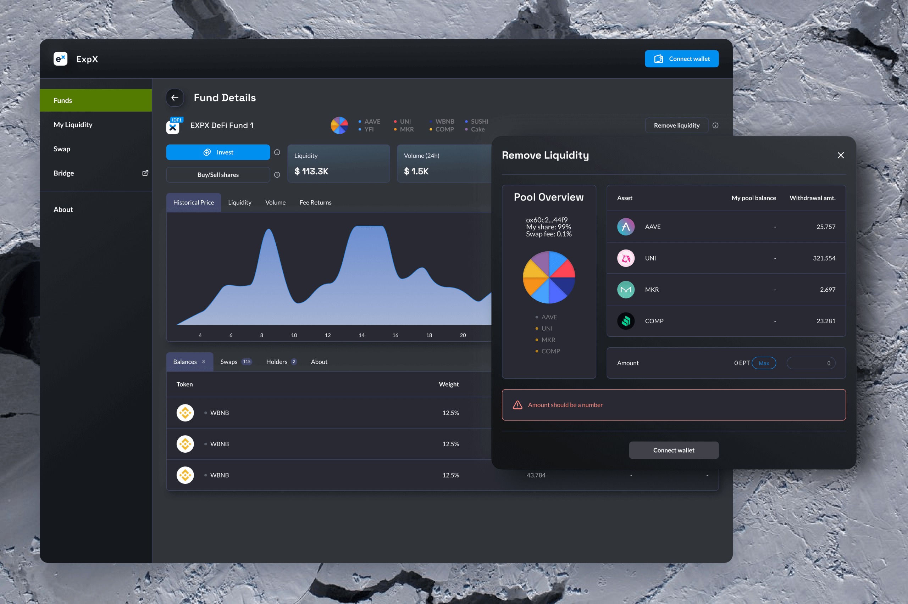
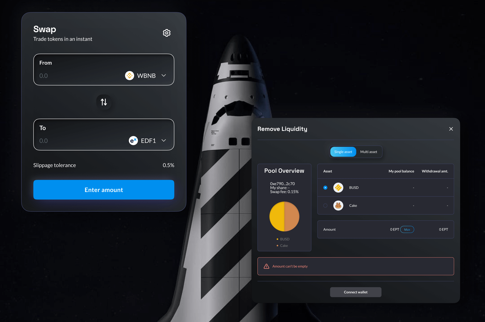

ExpX is a New Zealand-led project, with staff and partners all around the world including Dubai, Russia and Singapore.  
The core ExpX team includes successful IT entrepreneurs and Blockchain / Smart Contracts experts.

ExpX is a platform allowing anyone to both invest in and create decentralized cryptocurrency Index Funds with automatic 24/7 rebalancing and additional revenue generation from farming and swap commissions.

As a part of development team I was involved in this project in a role of a head of design. I was responsible for development and implementation of the creative strategy, brand identity, design of web platform where anyone can create decentralized cryptocurrency Index Funds.

ExpX web app is based on neomorphism concept with deep shadows, colorful gradients and dark UI.

Learn more about the project here This is an [here](http://example.com/ "With a Title").

