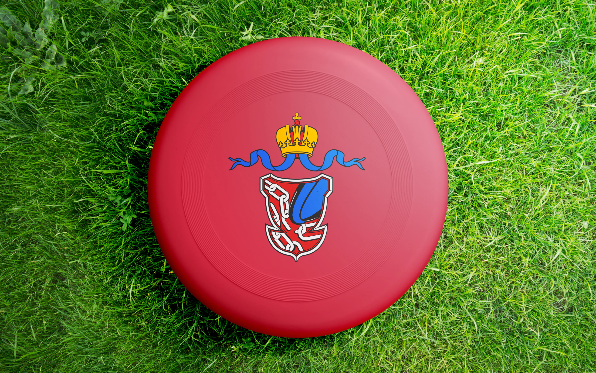

Disc golf is a new take on traditional golf and is played using plastic flying discs instead of clubs and balls. Disc golf is rapidly growing in popularity, actually it is one of the fastest-growing sports in modern times, with 33% increase in games played from 2019 to 2020 alone. Recent numbers are even more impressive.

While becoming a recognized and respected sport worldwide, disc golf is still in it's infancy in Russia and that's why people from Russian Disc Golf Association (RDGA) realized how vital well designed website is for the growth of community here.

The main idea is to provide a newbie with six simple steps how to became a PRO.
I welcomed this daring project that allowed me to design from scratch. And then I worked my magic as if it was my own project.

The website was planned to promote this sport in Russia like and as the easy and fast way to share most important and interesting facts with new and potential players. Creative process was rather long and with many iterations, but in the end RDGA got completely satisfied with the result: clean-looking, easy-to-use and adapted to any devices also with simple path to expand when necessary.

Check live project  — by following this [link](https://rdga.ru/ "RDGA RUS").
