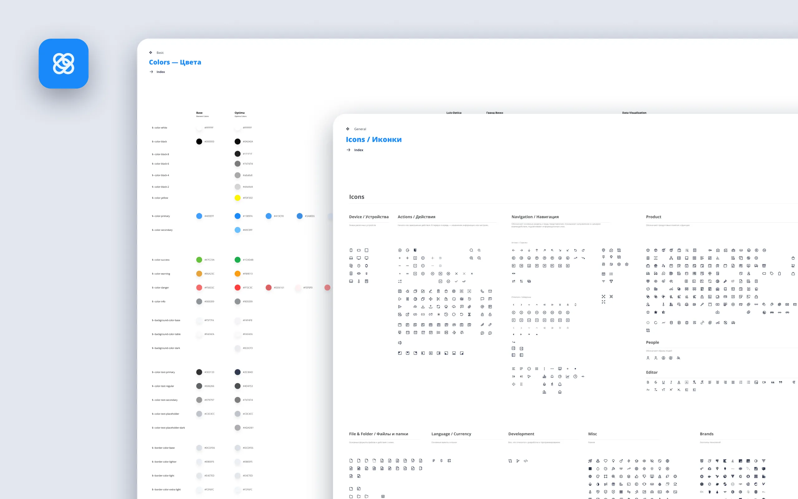
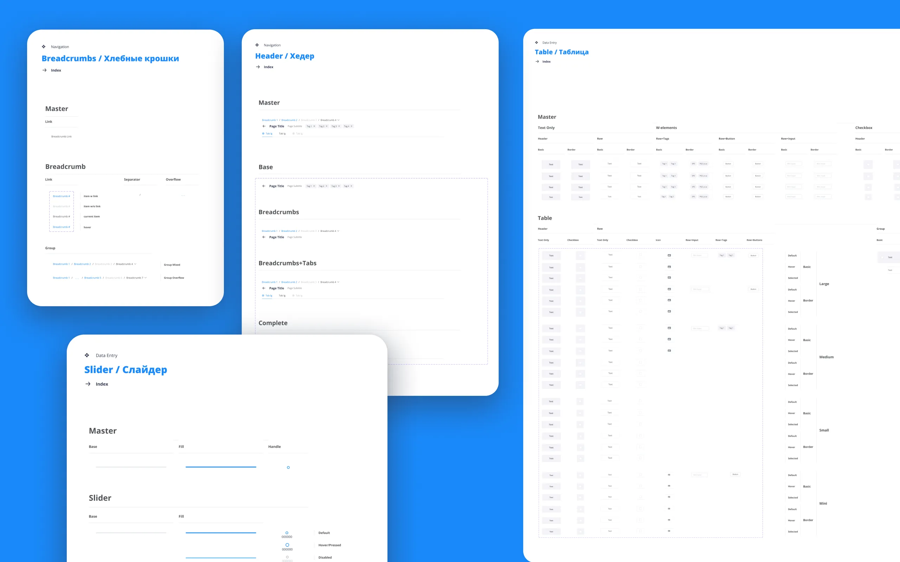

OptixDev provides high-quality software development outsourcing by a dedicated team of experienced professionals, covering all  needs from initial requirements gathering and system architecture design to final QA control and production roll-out.

For the development and modeling of the best user experience, a design system was used, developed on the basis of the Element UI (based on Vue JS).

The design system is built according to the principles of atomic design —  Atoms - Molecules - Organisms - Templates - Pages.

It helps to standardize design language, create coherent digital products and maintain consistency across multiple different products or platforms.

