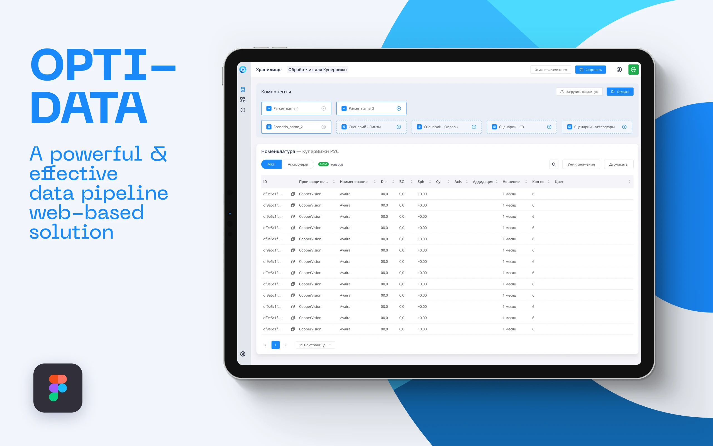
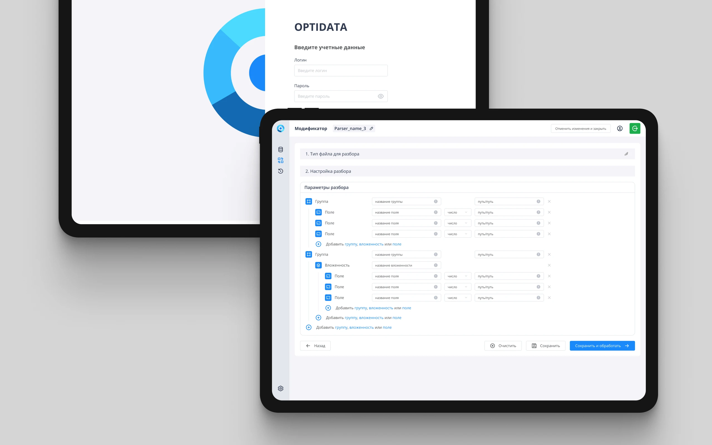
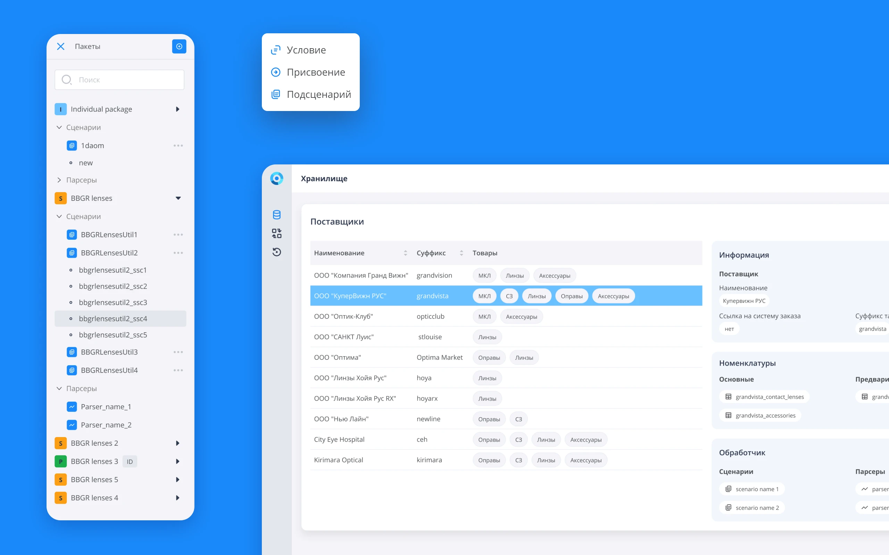
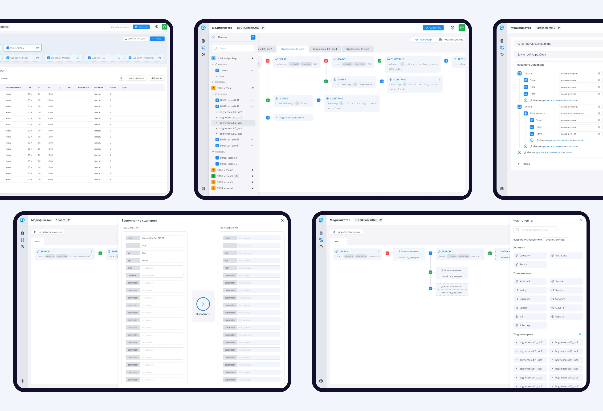

OptiData is powerful web-based solution which performs a sequence of actions that moves data from a source to another destination. 
There are a lot of nomenclature data files from different suppliers, each one with its own unique data set. It is necessary to store, organize and combine it to analyze it effectively.

The OptiData consists of two main modules:
**Storage** — storage of nomenclature and its analysis. 
**Modifier** —utility functions for data unification. 

