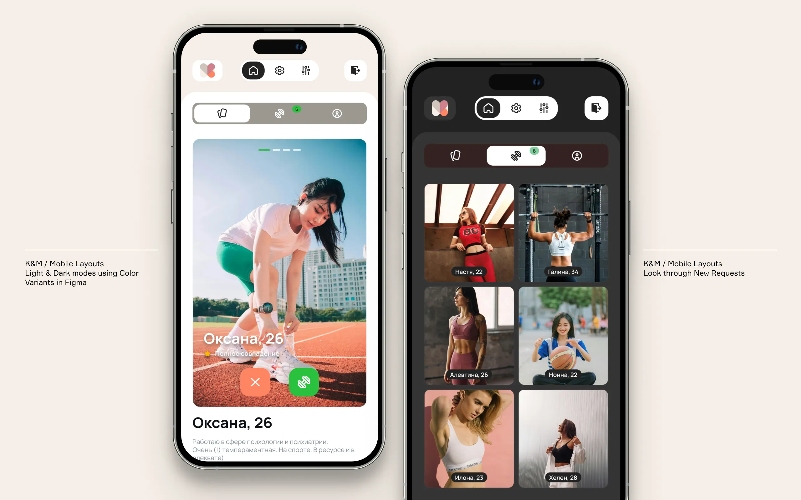
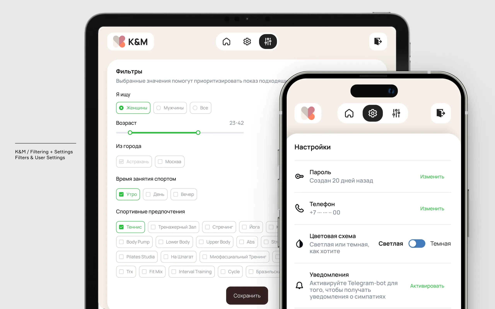
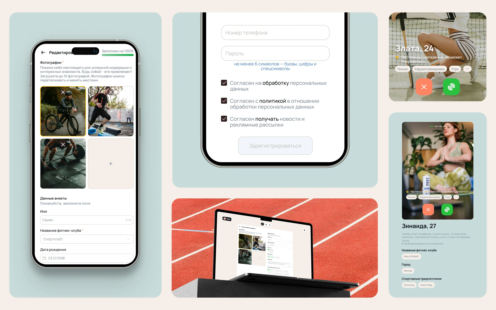

KM Dating App is the place to be to meet a partner for sport activities and/or the perfect match for dinner and more. 

Keeping in mind an idea of both dating and sports, I aimed to provide a modern and clean design, setting it apart from the other dating services. Simultaneously, the website should not be dull or neutral; it ought to make a strong impression for the users. In crafting this design formula, I kept both these variables in mind.

The webpage has two versions – light and dark (also designed in figma using variants). From mobile to desktop, I worked with dev team on responsiveness for all devices, providing a stable and intuitive experience.

Started with a concept of marketing app for local fitness club, now it becomes more popular and helps to connect people from different cities and sport clubs.

