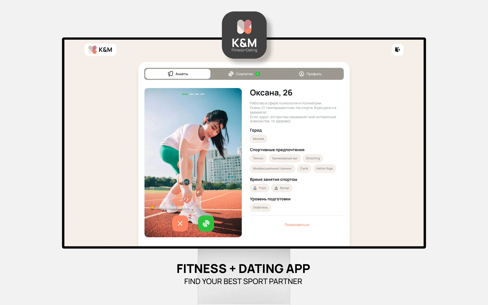
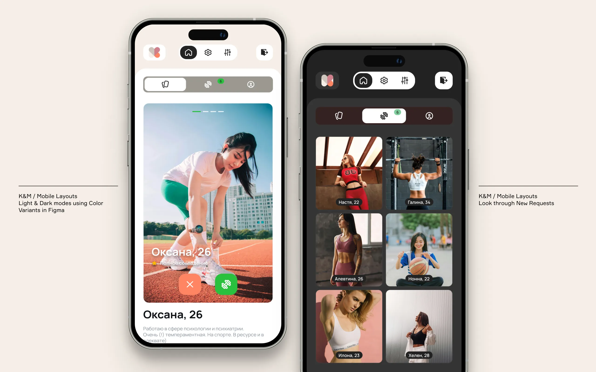
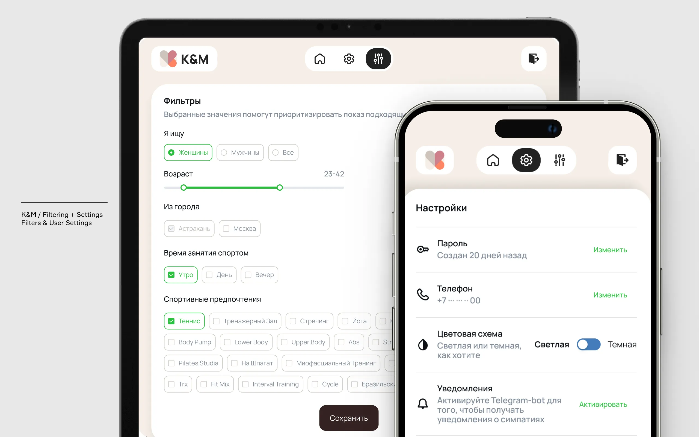
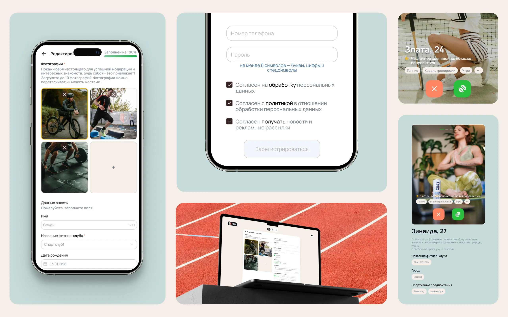

KM is primarily a workout-partner finder — built for people who want to train together, run together, or hit the same sport. A romantic match is a welcome bonus, not the main goal. 

Rossvik Club came with an idea born from their own community: members kept asking each other for training partners, and the club wanted a dedicated space for that instead of scattered chats and word of mouth. We built the product as an MVP — fast enough to validate the idea with real users, focused enough to not turn into a generic dating app.

The core design challenge was keeping that hierarchy clear at every step: sport-matching first, romance as an optional outcome. This shaped everything from the onboarding flow (built around sport, location, and availability, not just photos and bio) to the tone of the visual language — clean and energetic rather than the soft, romance-first aesthetic of typical dating apps.

The product was designed mobile-first — people look for a workout partner on the go, not sitting at a desk. I designed the core experience for mobile first, then extended it to desktop with the dev team, keeping the same clarity and speed across devices. It ships in both light and dark themes, both built as variants in Figma.

The MVP is currently being tested with Rossvik Club's community, with plans to expand to other clubs.

