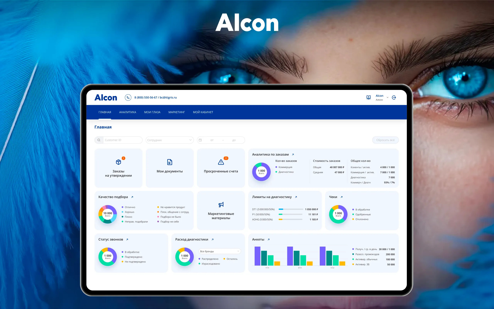
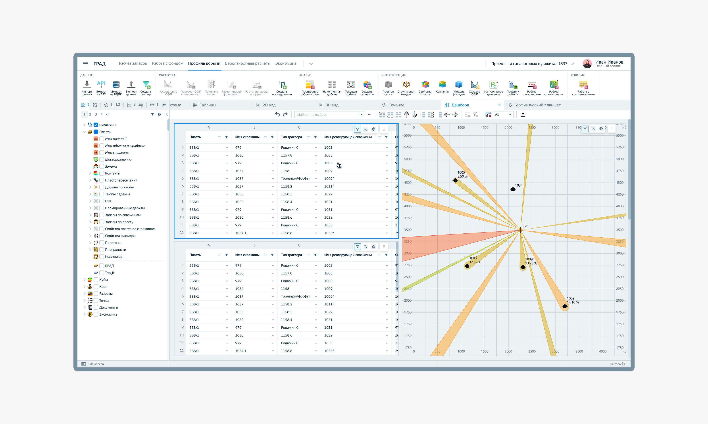
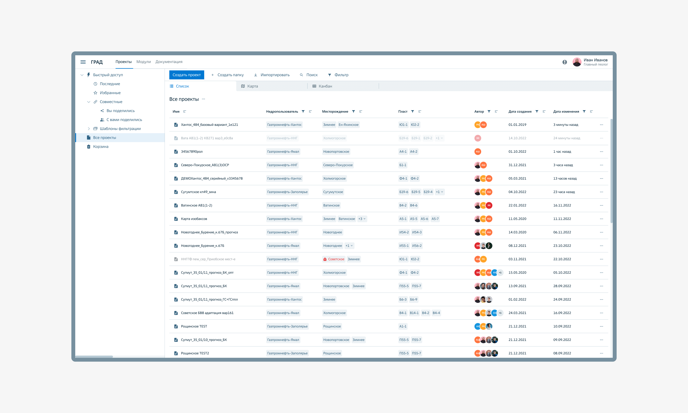
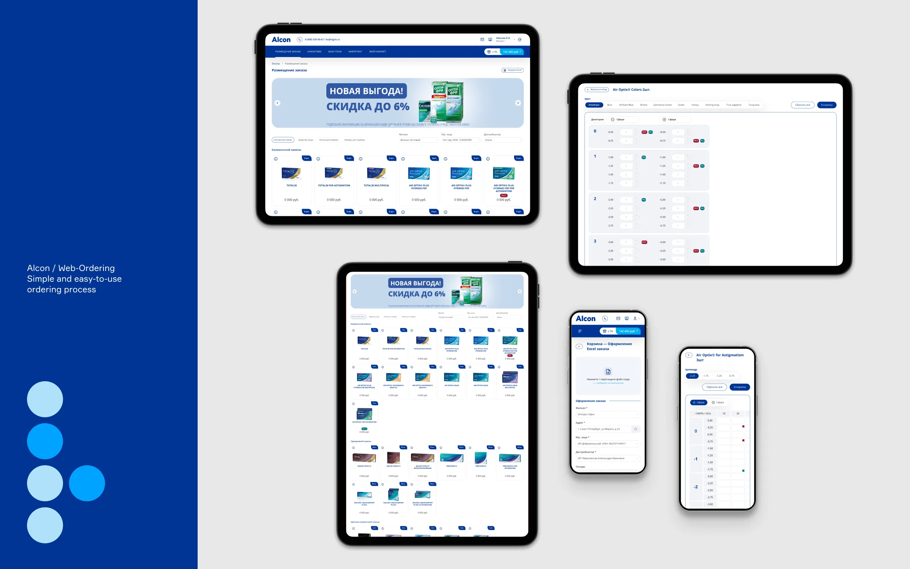
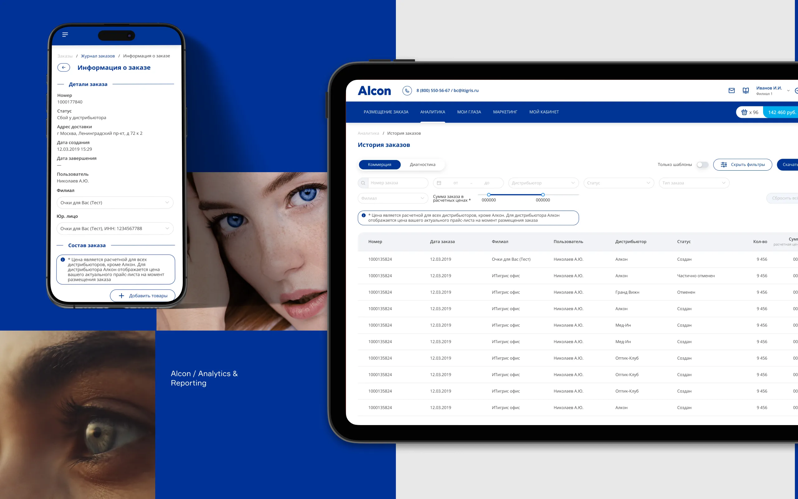
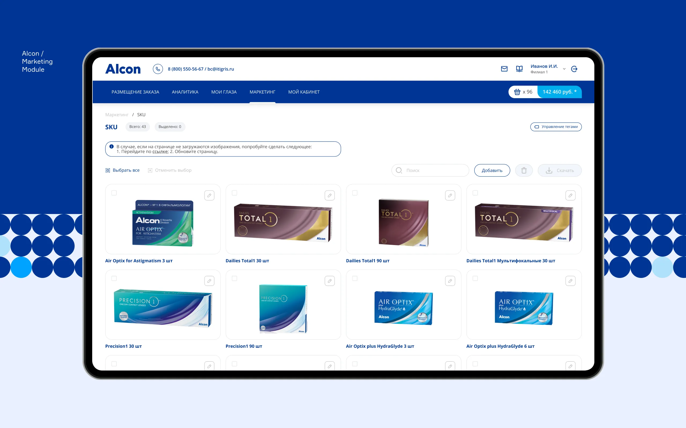

Alcon is the global leader in eye care, dedicated to helping people see brilliantly. With a 75+ year heritage, they are the largest eye care device company in the world – with complementary businesses in Surgical and Vision Care. It is a truly global company that works in over 70 countries and serves patients in more than 140 countries.

“MoiGlaza for Business” is a dedicated B2B workspace built into Alcon’s digital platform for optical retailers and business partners. The service enables partners to manage sales operations, pricing strategies, and product portfolios through a unified digital solution.

 

Originally designed as a web-ordering portal for Alcon contact lenses, the platform grew into a multifunctional back-office system for the company's partners, with a CRM, marketing, financial and other modules. As part of its strategy to keep enhancing the distributor experience, Alcon wanted to simplify the ordering process for partner opticians.

I designed and built the entire B2B cabinet — "My Eyes for Business" — from scratch: from the first wireframe to the final UI. The goal was to give partner opticians a single place to manage pricing, reporting, and marketing tools, replacing scattered spreadsheets and manual reconciliation with their Alcon representatives.

I designed the entire ordering workflow opticians use to order product from the distributor — contact lenses, trial fitting sets, and lens care solutions — end to end, from browsing the catalog to order confirmation and tracking. On top of that, I designed the mechanism for discounts, promotions, special offers, and pre-orders, giving opticians a single place to see and act on every commercial offer from Alcon instead of tracking them through separate emails or calls.

The B2B cabinet became part of "My Eyes" ("МоиГлаза") — an omnichannel platform now connecting consumers, ophthalmologists, and partner opticians. By late 2022, the platform united 300,000 consumers with engagement significantly above the segment average. Across the platform, offline foot traffic at partner locations grew by 40% and average purchase value rose by 10% after launch, with over 90% of partner opticians rating their collaboration with Alcon at the highest score.

