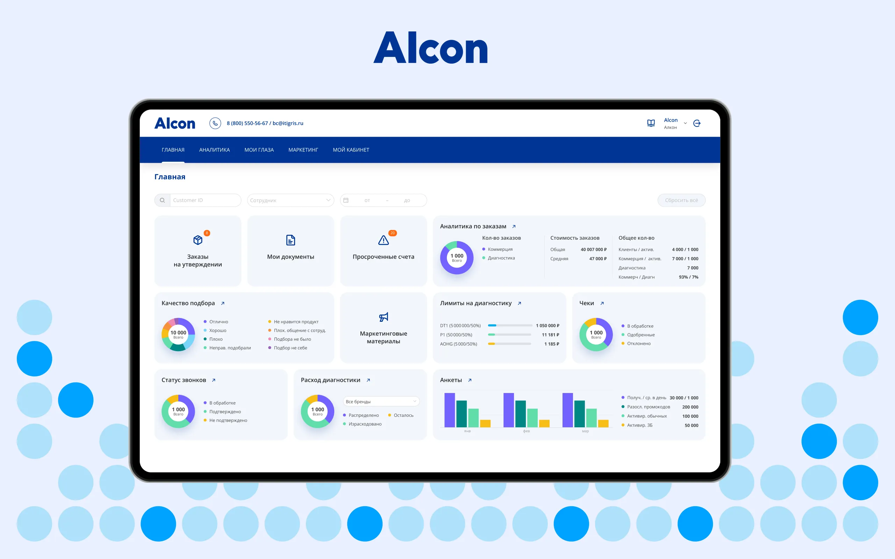
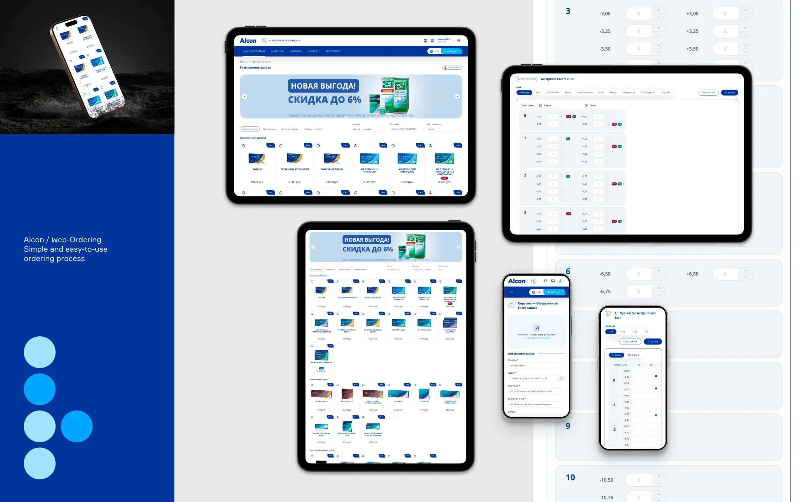
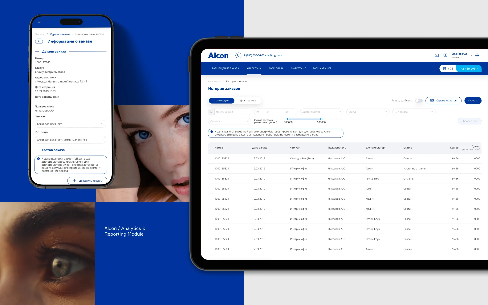

Alcon is the global leader in eye care, dedicated to helping people see brilliantly. With a 75+ year heritage, they are the largest eye care device company in the world – with complementary businesses in Surgical and Vision Care. It is a truly global company that works in over 70 countries and serves patients in more than 140 countries.

Originally designed as a web-ordering portal for Alcon contact lenses, it has grown into a multifunctional back office system for the company’s partners, with a CRM, marketing, financial and other modules. As part of its strategy to keep enhancing the distributor experience, Alcon wanted to simplify the ordering process.

