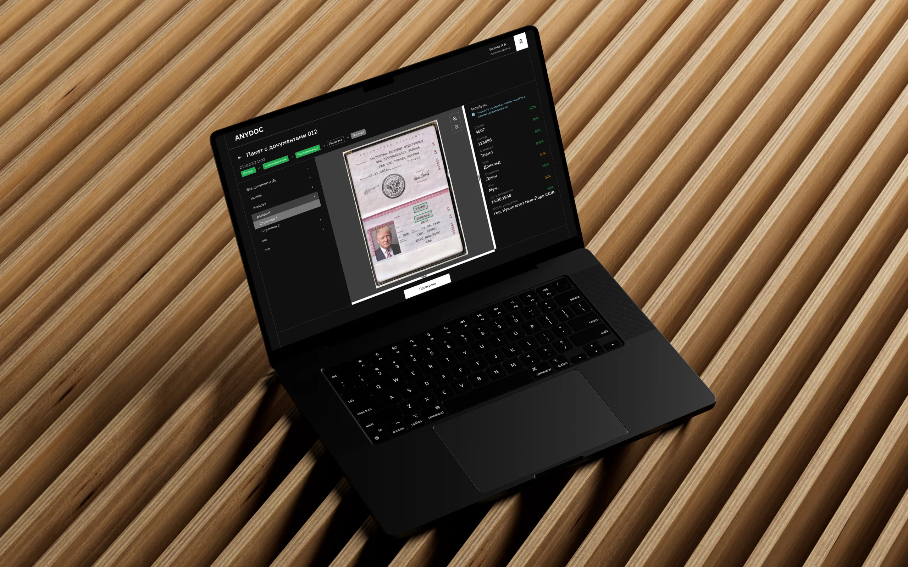
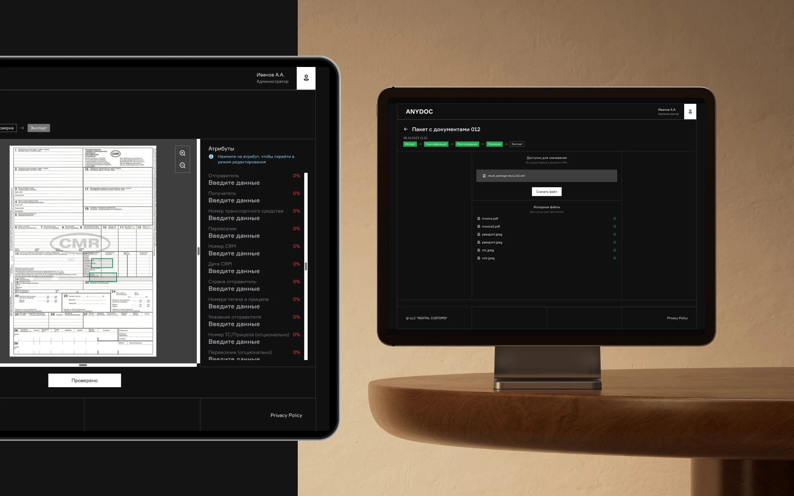
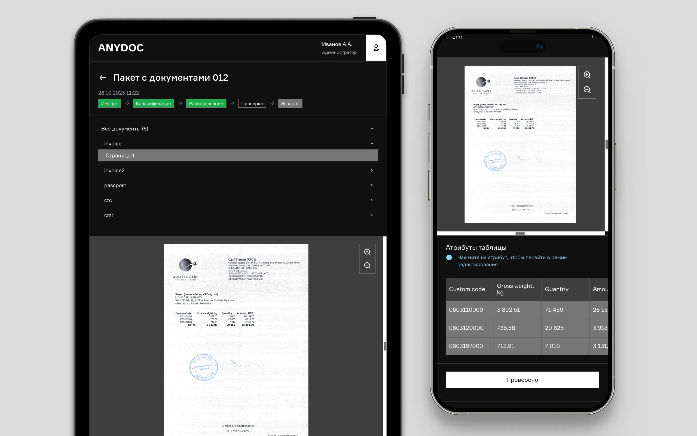
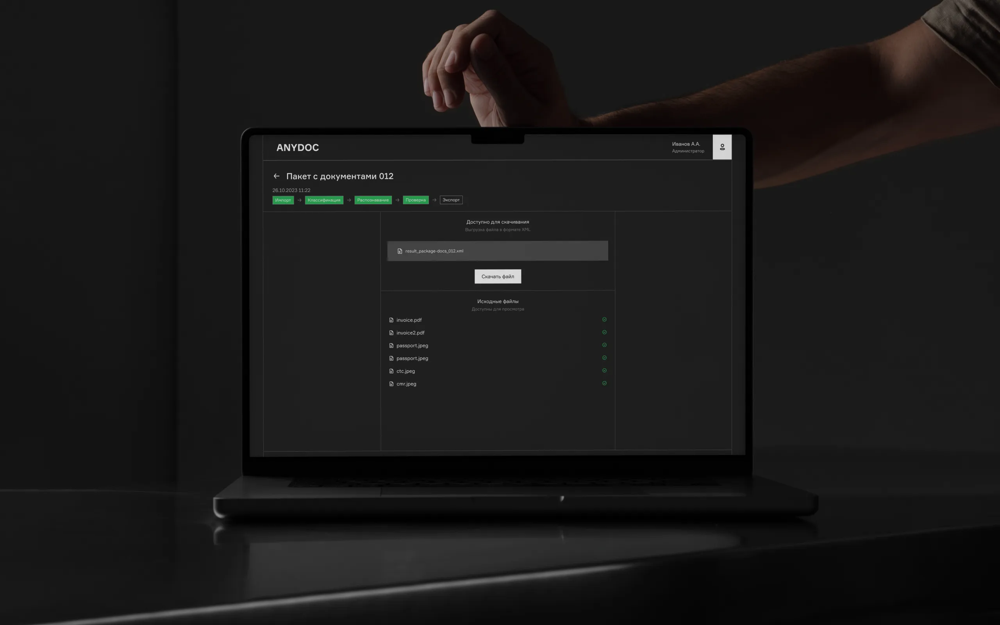
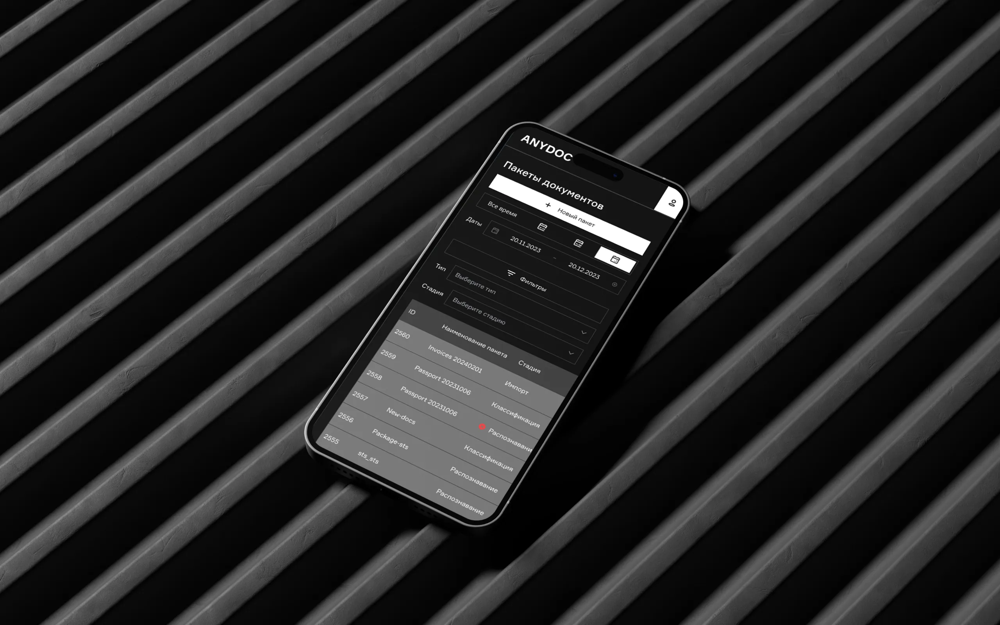

INDITAL is developing a digital ecosystem for international logistics, combining freight transportation, customs clearance, and value-added services into a unified platform. Designed for global supply chains, the platform streamlines cross-border operations and sets a new benchmark for speed, transparency, and customer experience.

The company deals with a wide variety of paper documents every day. In order to digitalize the process of customs clearance they wanted to implement the solution for document recognition, making it easier to turn static images into editable text.

AnyDoc is a document recognition and management platform — users upload document packages (passports, invoices, CMR forms), the system processes/recognizes them, and users can manually verify results.

Problem

Customs specialists spent a significant amount of time manually validating document packages. The repetitive workflow was slow, error-prone, and frequently led to customs delays and reprocessing.

Solution

I designed an AI-assisted document verification experience that combines automatic data extraction with human oversight. The system pre-fills document templates using OCR, surfaces confidence scores for each recognized field, and highlights uncertain values that require review. This dramatically reduces cognitive load while ensuring operators remain in control of every submission.

Impact

4–5× faster document processing
60% reduction in fully manual document reviews
8× increase in operator throughput

