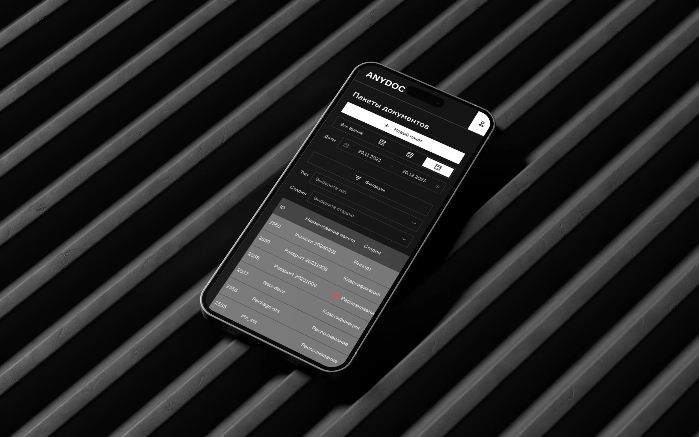

Indital Group is a leading provider of integrated customs transit clearance, integrated logistics and customs services, connecting businesses with new supply chain optimization opportunities in a dynamically changing market. Custom business deals with a wide variety of paper documents every day. In order to digitalize the process of customs clearance they wanted to implement the solution for document recognition, making it easier to turn static images into editable text.

Anydoc webapp converts documents or images into machine-readable text. One can then edit, search, manipulate, or store this text data — for example, you can turn invoices into an itemized table or transform a passport / driver license into an editable document.

We employed a monochromatic color palette and opted for sleek, minimalist fonts. Our goal was to maintain a clean and orderly design

