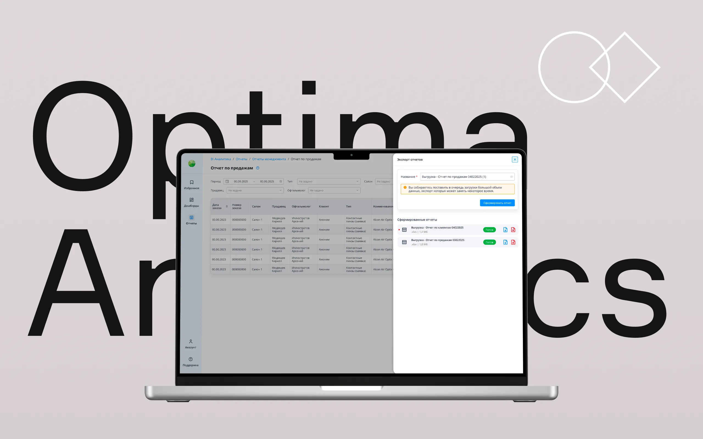
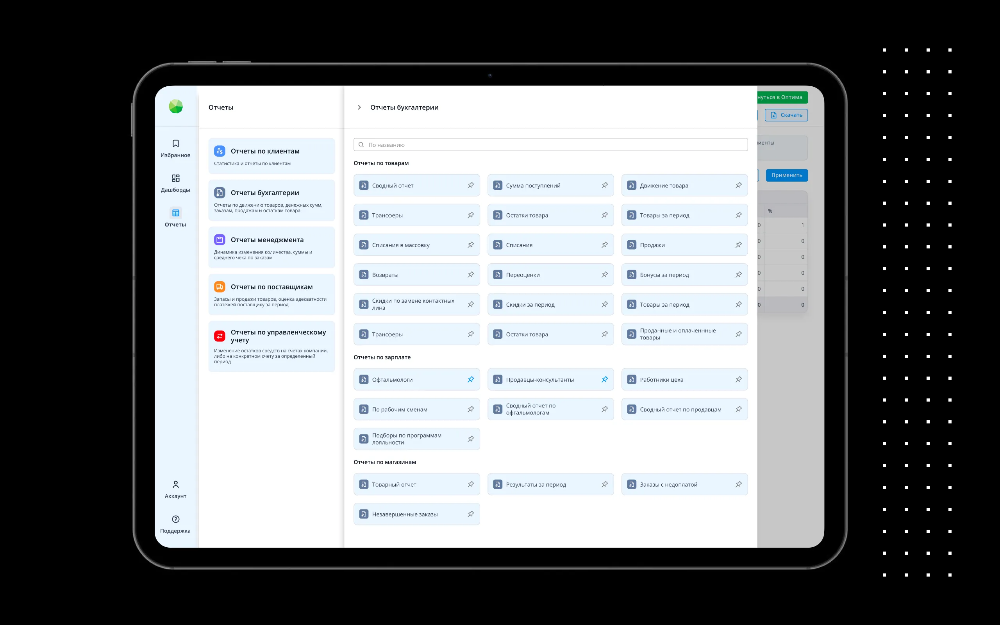
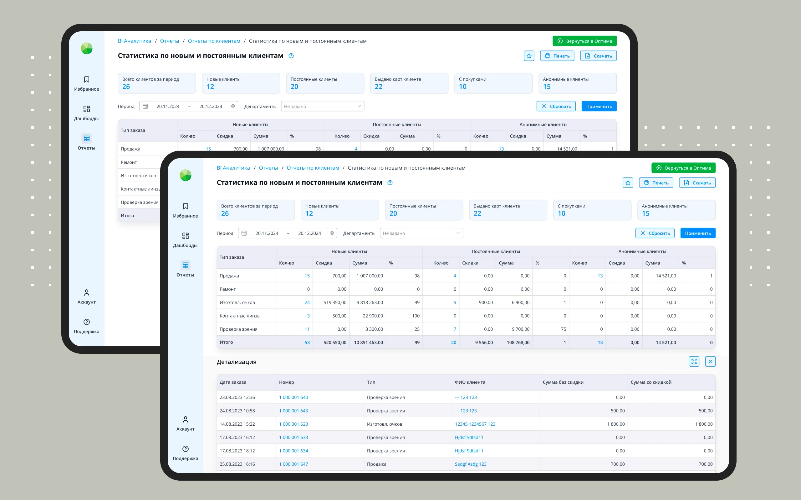
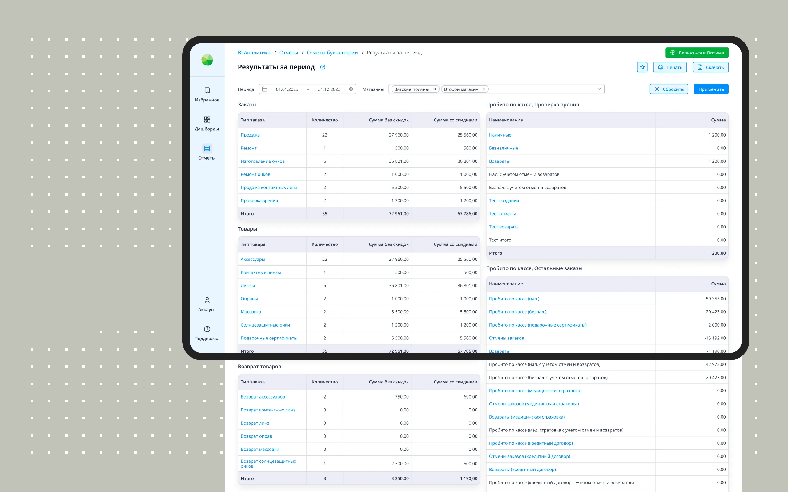
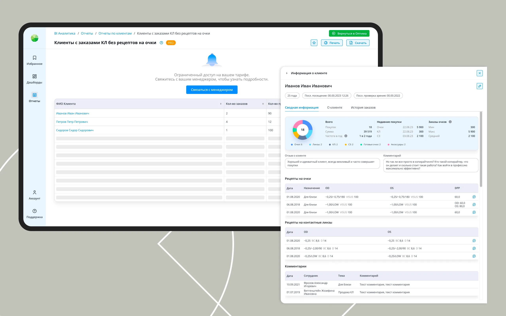
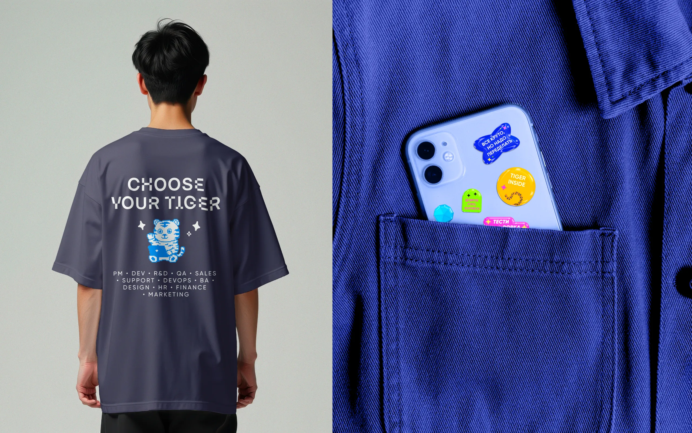

Client: Itigris Optima LLC

Role: Art director

Context: Optima BI is an analytics service created specially for optic businesses. It allows to analize data from various sources, provide different kind of business reports, visualize data, create dashboards and share the results. With this solution business owners and managers can track any product and business metrics directly from the platform to make data-driven decisions.

Team: +1 designer

Responsibilities: Art-direction and design-ops, Formation of design-product strategy, Creation and development of the design-system, Conceptual design, Communication design: branding, merch design

