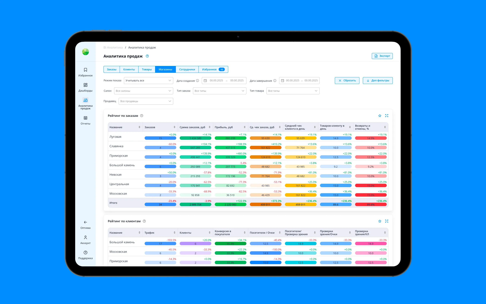
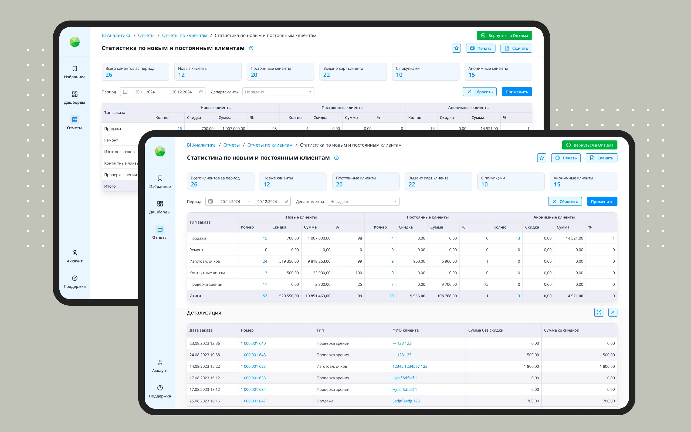
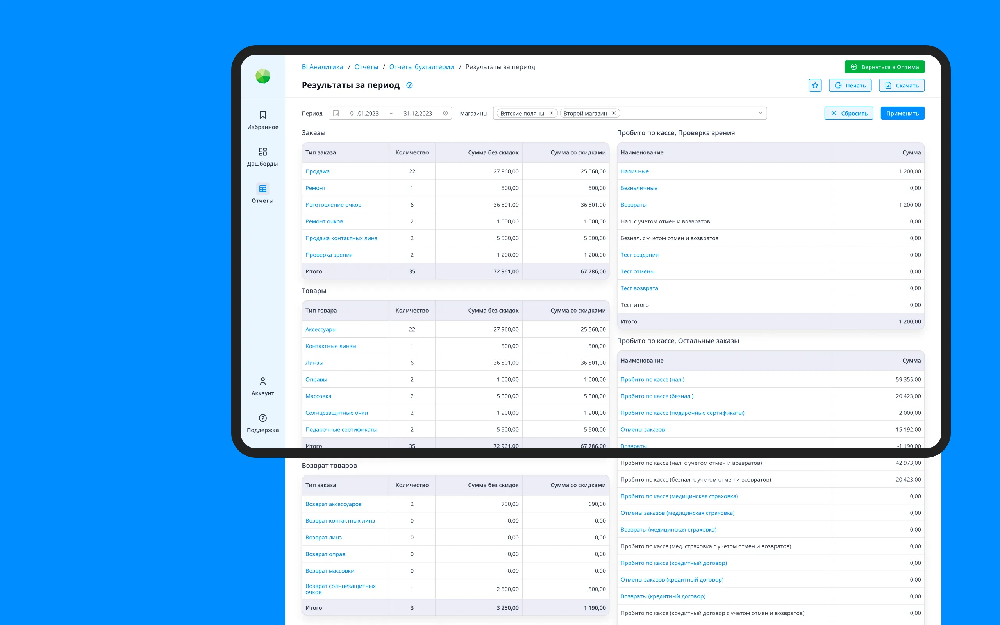
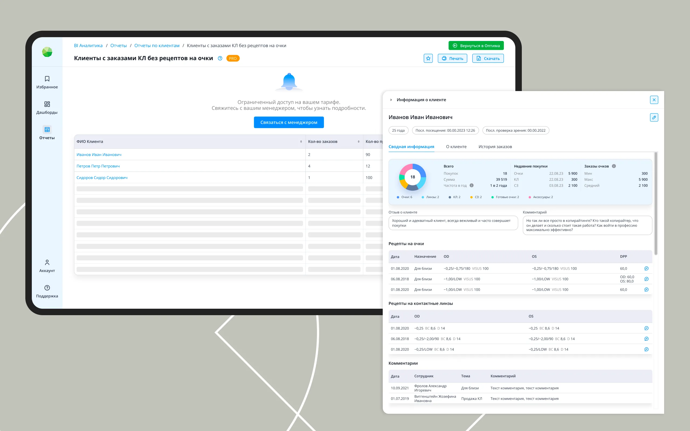
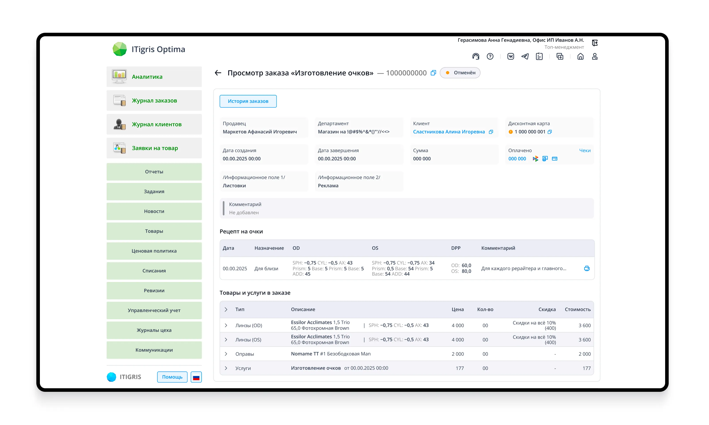

Optima BI is an analytics service created specially for optic businesses. It allows to analize data from various sources, provide different kind of business reports, visualize data, create dashboards and share the results. With this solution business owners and managers can track any product and business metrics directly from the platform to make data-driven decisions.

Optima BI is an analytics service created specially for optic businesses. It allows to analize data from various sources, provide different kind of business reports, visualize data, create dashboards and share the results. With this solution business owners and managers can track any product and business metrics directly from the platform to make data-driven decisions.

Built the company's and product's employer brand by hiring, mentoring, and growing the product design team. Evaluated the maturity of the design organization and defined the design strategy for the product's next phase. Introduced product training for designers to deepen their understanding of user workflows and industry best practices. Defined business and product KPIs, identified strategic opportunities for design and product growth, and aligned design efforts with business objectives. Led product branding initiatives and the design of branded merchandise.

Delivered internal lectures and webinars on product design, design methodology, and the evolution of design within the company. Developed the product's visual identity and branded merchandise. Advocated for design across the organization, fostering stronger relationships between designers and business stakeholders and increasing trust in the design function. Helped improve team motivation, collaboration, and cross-functional alignment.