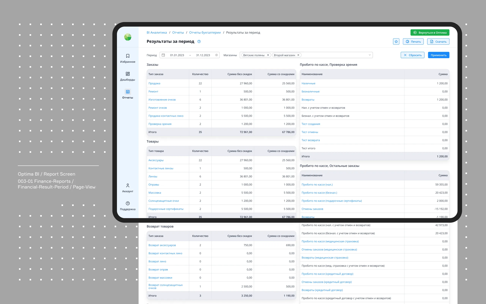

Optima BI is an analytics service created specially for optics, eyewear stores and companies. It allows to analize data from various sources, provide different kind of business reports, visualize data, create dashboards and share the results. With Optima BI, business owners and managers can track any product and business metrics directly from the platform to make data-driven decisions.
Main goals: f2345908583240958940-237597c23b92v-

