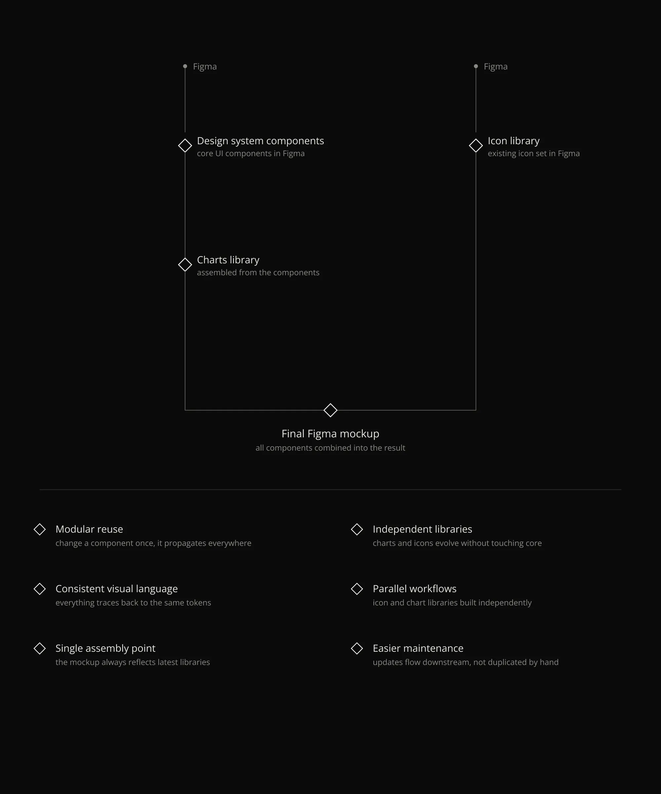
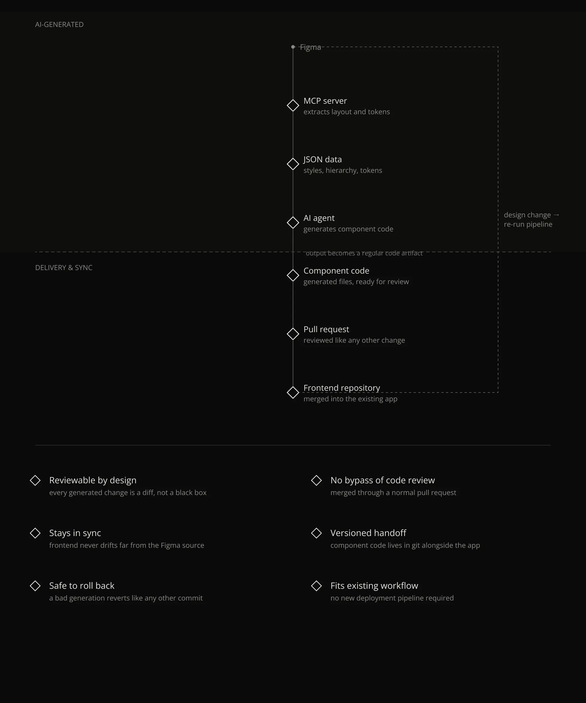
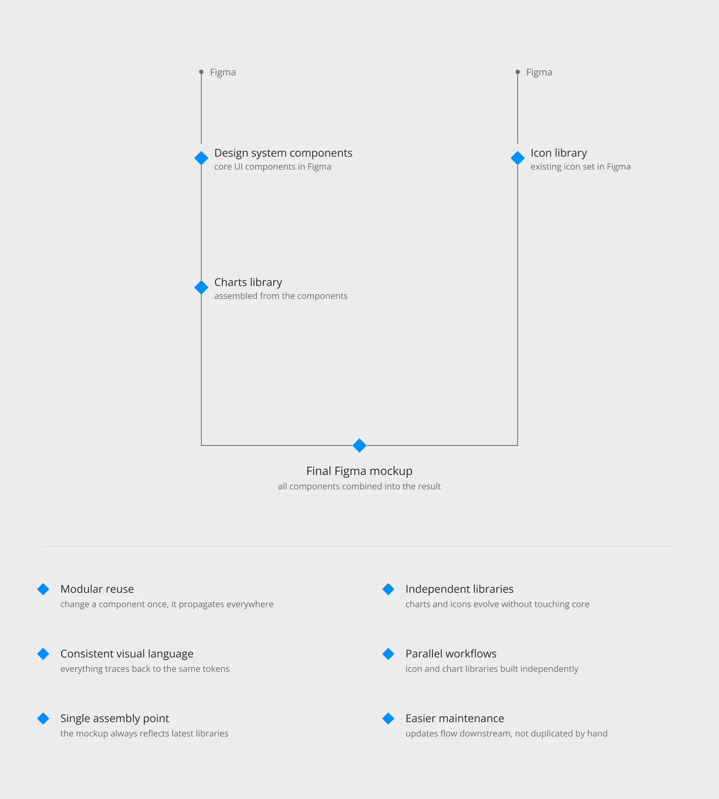
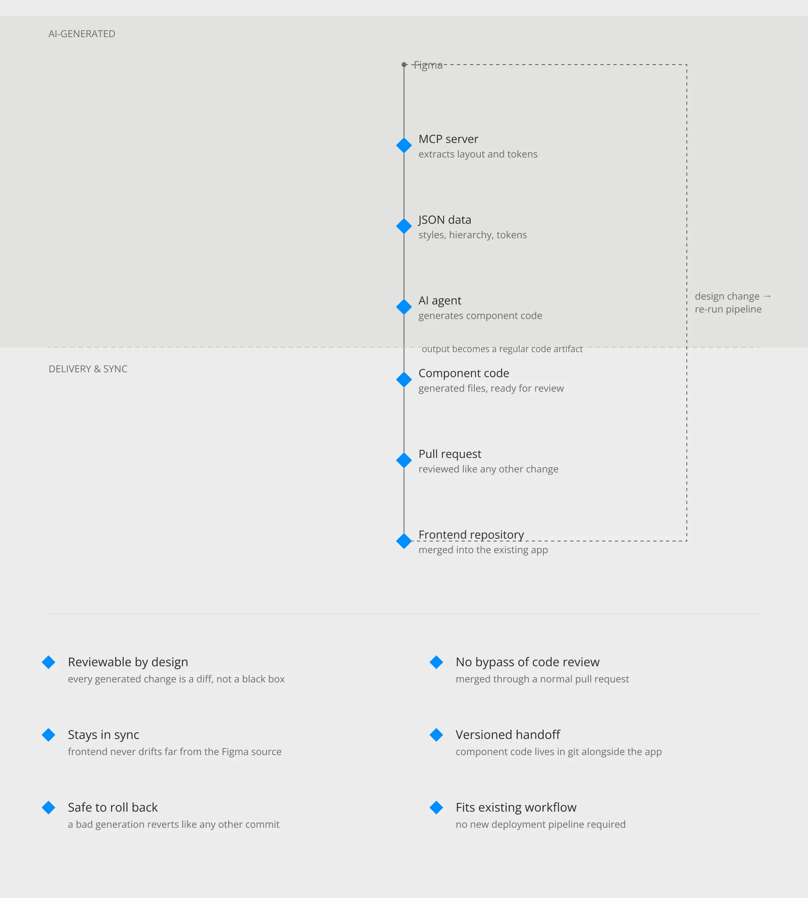
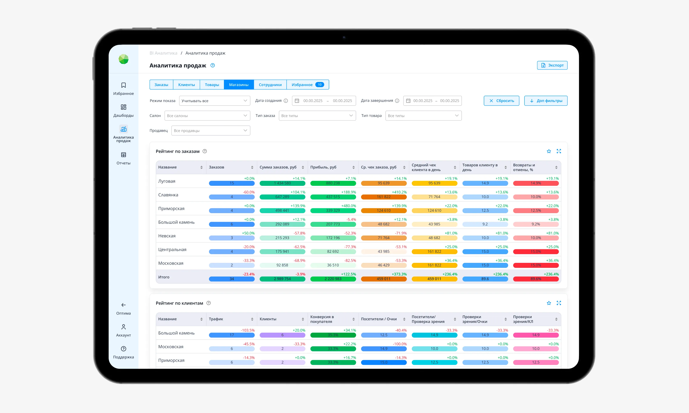
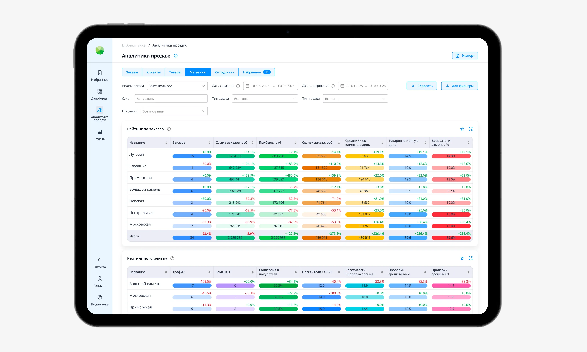
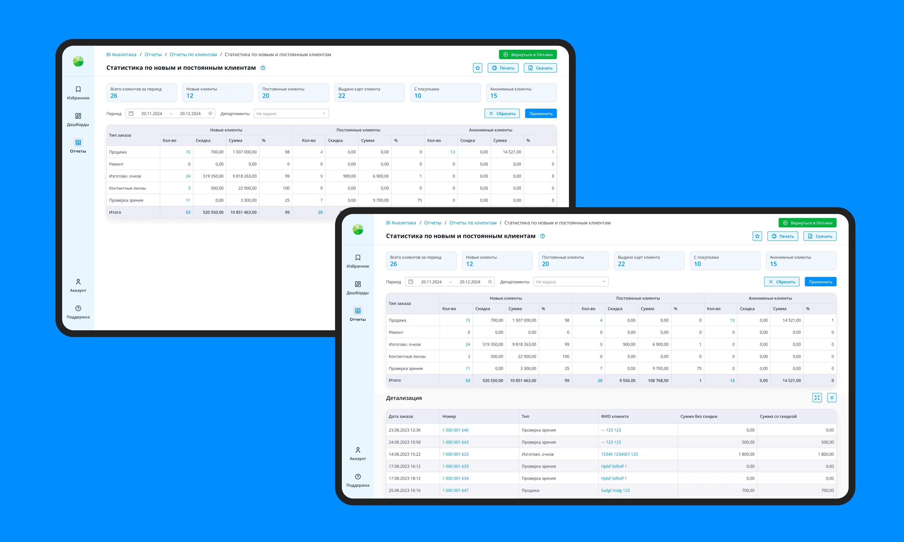
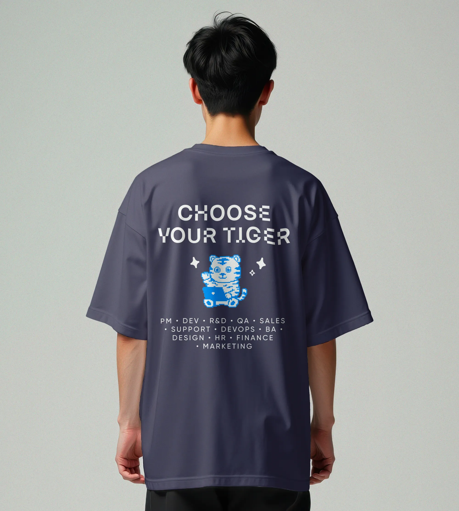
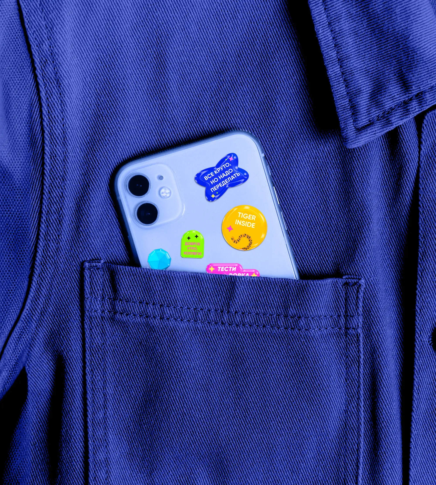

Optima BI — аналитический сервис для оптического бизнеса. Он объединяет данные из разных источников, помогает создавать отчёты и дашборды и принимать решения на основе бизнес-метрик.

Когда я присоединился к команде, общей дизайн-системы не было: интерфейсы создавались разработчиками на базе устаревшего кода, а решения хранились в головах отдельных людей.

Библиотека дизайна — я создал библиотеку компонентов на базе Element UI, ApexCharts и Ant Charts, адаптировав её под задачи продукта. Со временем библиотека стала самостоятельной дизайн-системой, которую могли поддерживать и развивать независимые команды.

 

Интерактивные прототипы — я внедрил low-fidelity-прототипирование для проверки функций, пользовательских потоков и продуктовых гипотез. Это сократило время согласования дизайна в 3 раза и уменьшило количество редизайнов после релиза.

 

Фреймворк продуктового видения — вместе с кросс-функциональными командами я сформировал единое представление о целевом опыте продукта для бизнеса, аналитики и разработки. Дизайн-артефакты были организованы вокруг пользовательских сценариев и смысловой архитектуры.

 

Я вырастил дизайн-команду от одного специалиста до небольшой самостоятельной команды: выстроил найм, онбординг и систему менторства, а также определил продуктовые и бизнес-KPI для развития дизайна.

Я развивал бренд работодателя и визуальную идентичность продукта, проводил лекции и вебинары по продуктовому дизайну и помогал укреплять роль дизайна внутри компании.

 
